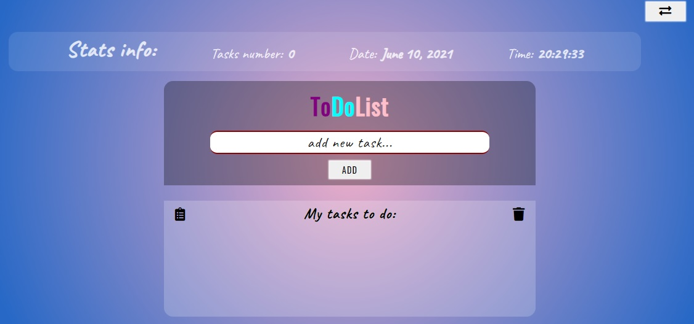

# ToDoListApp

## Demo

[**click live demo of the project**](https://dominiksiejka.github.io/ToDoList/)



## Table of Contents

- [About the Project](#description)
- [How to use](#how-to-use)
- [Technologies used](#built-with)
- [Setup steps](#setup)
- [Sources](#sources)
- [License](#license)

## Description

ToDoListApp enables you to add tasks, edit single task, remove single task, remove all tasks and checkout the changelog which shows which tasks were deleted and edited. Make a shopping list or your plan your the upcoming week.

## How to use

To add a single task in the input field write the text content and then press enter or the button next to it. The task will appear on the left side of a single task there is a text content and on the right side there are two buttons which enable you to edit or delete the task. You can simply remove all tasks at once by clicking the trash icon on the top right corner of the app. On the left top corner of the app there is a button which will show you the changelog of the tasks so deleted and edited task will be there as well. Feel free to test it yourself.

## Built with

- HTML5
- CSS/SASS
- Vanilla JavaScript

## Setup

```
with BASH

# clone the remote repo to your local one
$ git clone https://github.com/dominiksiejka/ToDoList.git

# open the index.html file or use your code editor to open it with live server

```

## Sources

- Icons from [Font Awesome ](https://fontawesome.com)
- Font from [Google Fonts ](https://fonts.google.com/)

## License

- MIT © [Dominik Siejka ](https://github.com/dominiksiejka/ToDoList)
